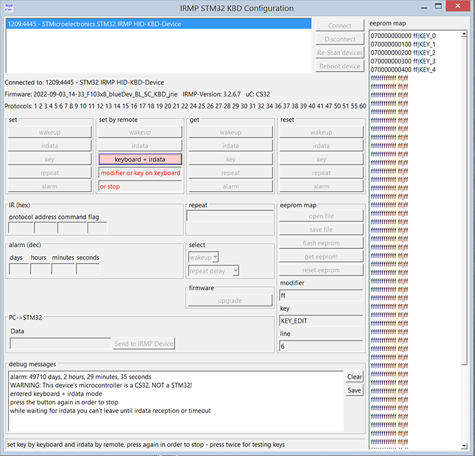
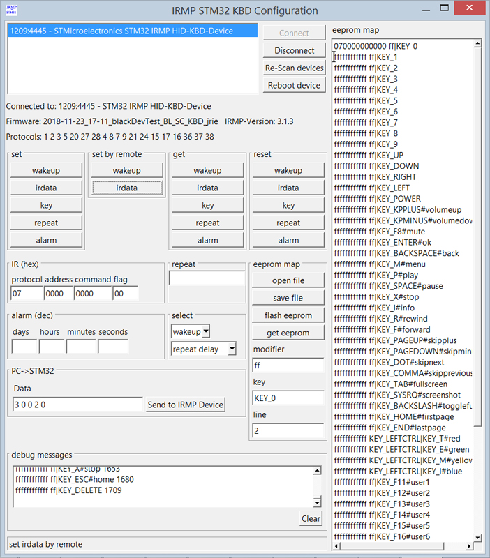
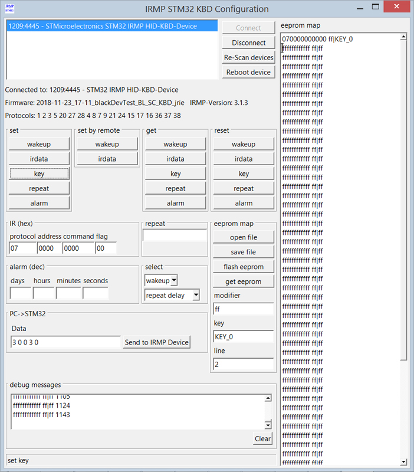
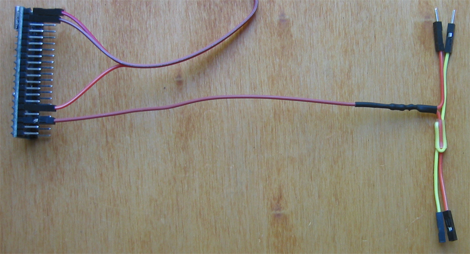
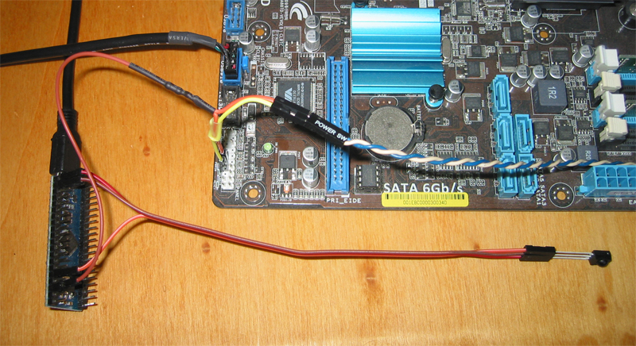
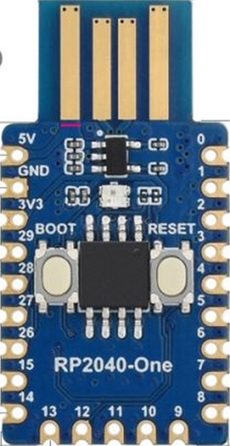

# IRMP auf Pico - ein USB-HID-Keyboard IR-Empfänger/Sender/Einschalter mit Wake-up Timer

Ein Fernbedienungsempfänger mit vielen Funktionen basierend auf billiger Hardware.

 [*]  
 [**]  

## Einleitung
Für Boards mit RP2040 und RP2350, z.B. Pico und Pico2 sowie viele andere. Darauf wird eine Open-Source-Firmware mit vielen Funktionen geflasht.

## Merkmale
* Anschluss über USB 
* registriert sich als USB HID Keyboard Gerät *und* erscheint als /dev/hidraw oder „Custom HID device“, keine Treiber erforderlich
* überträgt die Daten über USB2 in Hardware mit Fullspeed 
* IR-Empfänger (ca. 40 Protokolle in Hardware dekodiert) 
* Einschalten des PCs per Fernbedienung von S3 (STR) und S4 (STD) über USB oder von S3, S4 und S5 (SoftOff) über den Einschalter  auf der Hauptplatine (+5V erforderlich, über USB oder vom Netzteil oder der Hauptplatine) 
* Einschalten des PCs über den eingebauten Timer von S3 (STR) und S4 (STD) über USB oder von S3, S4 und S5 (SoftOff) über den Einschalter auf der Hauptplatine (+5V erforderlich, über USB oder vom Netzteil oder der Hauptplatine) 
* IR-Sender (etwa 40 Protokolle) 
* die Konfiguration wird im emulierten Eeprom gespeichert
* Makro Unterstützung (eine Folge von IR-Befehlen werden gesendet, wenn eine bestimmte Taste empfangen wird)

## Software Linux
* GUI-Konfigurationswerkzeug irmpconfig_gui für die Konfiguration: Wakeups, Makros, irdata, Tasten, Alarmzeit, Wiederholung setzen, abrufen und zurücksetzen. Es ist möglich, Wakeups, Makros und irdata über Fernsteuerung zu programmieren. Erstellen der Eeprom-Map mit Fernbedienung und Maus. Umfassende Debug-Meldungen. Firmware-Aktualisierung.
* Interaktives Kommandozeilenprogramm irmpconfig zur Konfiguration: Setzen, Abrufen und Zurücksetzen von Wakeups, Makros, irdata, Tasten, Alarmzeit, Wiederholung und Senden von IR. Es ist möglich, Wakeups, Makros und irdata per Fernsteuerung zu programmieren.
* irmpalarm zum Setzen und Auslesen der Alarmzeit per Skript

## Software Windows
* GUI-Konfigurationsprogramm irmpconfig_gui (wie bei Linux)
* interaktives Kommandozeilenprogramm irmpconfig (wie bei Linux)
* irmpalarm zum Setzen und Auslesen der Alarmzeit per Skript

## Erstellen einer Eeprom-Map
irmpconfig_gui kann verwendet werden, um eine Eeprom-Map mit der Tastatur und der Fernbedienung zu erstellen.  
Es gibt drei Methoden.  
  
(1)  
  
Erste Methode: Klicken Sie auf eine Zeile, klicken Sie auf „set by remote - keyboard + irdata“, drücken Sie den Modifikator oder die Taste auf Ihrer Tastatur, drücken Sie die Taste, wenn der erste ein Modifikator war, drücken Sie den Knopf auf der Fernbedienung.  
Der rote Text unter der Schaltfläche „keyboard + irdata“ führt Sie durch den Vorgang.  
Wiederholen Sie diesen Vorgang so oft wie nötig.  
  
(2)  
  
Zweite Methode: Öffnen Sie die Vorlage keymap. Entfernen Sie Zeilen mit Tasten, die Sie nicht benötigen.  
Klicken Sie auf die Zeile mit dem Namen der Taste, klicken Sie auf „set by remote - irdata“, drücken Sie die Taste auf der Fernbedienung - wiederholen Sie dies für alle Tasten.  
Klicken Sie auf „flash eeprom“.  
  
(3)  
  
Dritte Methode: Klicken Sie auf eine Zeile, klicken Sie auf „set by remote - irdata“, drücken Sie die Taste auf der Fernbedienung.  
Klicken Sie auf eine Zeile, geben Sie den Key (und den Modifikator) ein und klicken Sie auf „set - key“.  
Wiederholen Sie diesen Vorgang so oft wie nötig.  

Wenn Sie die Tastatur + irdata-Taste zweimal drücken, können Sie Ihre Tastaturtasten und unter Windows sogar bereits konfigurierte Tasten auf der Fernbedienung testen.  

Unter Linux können Sie die Eeprom-Map mit evtest testen: Nachdem man die Taste auf der Fernbedienung gedrückt hat, sollte evtest die entsprechende Taste anzeigen.

Es wird empfohlen, mit einem frischen Eeprom zu beginnen, indem man „eeprom map - reset eeprom“ drückt.

## Emuliertes Eeprom
Jede Konfiguration, die mit einem der Konfigurationsprogramme vorgenommen wird, wird zunächst nur im Cache gespeichert. Um
diese Änderungen dauerhaft im Flash zu speichern, muss ein Eeprom-Commit durchgeführt werden.
Ausnahme: Der erste wakeup wird aus Gründen der Abwärtskompatibilität von der Firmware übertragen.

## Wakeup anlernen
Wenn das Wakeup leer ist, werden die ersten empfangenen IR-Daten im Wakeup gespeichert.  
Wakeup mit irmpconfig_gui ändern: set by remote - wakeup drücken, Taste auf der Fernbedienung drücken.  
Wichtig zum Testen: Wakeup findet nur statt, wenn der PC ausgeschaltet ist.  
Wenn der PC eingeschaltet ist, wird nur die Taste an den PC gesendet (man kann also die gleiche Taste zum Ein- und Ausschalten verwenden).  

## Aus den Quellen bauen
Siehe [Getting Started with the Raspberry Pi Pico](https://rptl.io/pico-get-started)  
-> SDK und die Beispiele herunterladen  
-> Toolchain Installieren  
-> „Blink“ erstellen  
-> „Blink“ hochladen und ausführen  

## Firmware flashen
USB Verbindung trennen.
BOOTSEL-Taste gedrückt halten und das Gerät an den USB Anschluss anstecken. Das Gerät wird als Massenspeicher angezeigt (USB ID 2e8a:0003).  
Die Datei firmware.uf2 per Drag & Drop auf den Massenspeicher ziehen. Das Gerät startet neu als IRMP HID Gerät.

Durch das Senden des Befehls „reboot“ wird das Gerät ebenfalls in den Massenspeichermodus versetzt.

Wenn sich bereits eine ältere Firmware auf dem Gerät befindet, versetzt irmpconfig - b das Gerät in den Massenspeichermodus, und
picotool load -v -x firmware.uf2 flasht die Firmware, verifiziert und startet sie.

Man kann auch irmpconfig_gui verwenden (picotool muss installiert sein).  

## Motherboard Test
Wenn einer der Einschaltpins an Masse liegt und der andere ca. +3,3 V oder +5 V führt, ist das Motherboard für die folgende einfache Verkabelung geeignet.  
Wenn nicht (sehr selten) braucht man einen Optokoppler.

## Kabel löten und anschließen
Ein 10 cm Dupont-Kabel wird aufgetrennt, die beiden Enden miteinander und dem 220 Ohm Widerstand verbunden, das andere Ende des Widerstands wird mit einem 20 cm Dupont-Kabel, dessen eine Buchse abgeschnitten ist, verbunden. Lötstellen einschrumpfen und das zweite 10 cm Kabel mittels Schrumpfschlauch anheften.  
Der TSOP wird direkt mit den Pins 3,3 V, GND und IR_IN verbunden, das Kabelpaar wird zwischen die Mainboard-Einschaltpins und den Stecker des Einschalters eingeschleift.  

## Erster Test
Wenn man im Suspend-Modus die BOOTSEL-Taste drückt, sollte der PC aufwachen.

## Pin-Out
Siehe /src/config.h.

## eventlircd, udev und systemd
Siehe /configuration/README.

## 5 V vom Netzteil statt über USB
Wenn das Gerät vom Netzteil versorgt werden muss, darf es nicht zusätzlich über USB versorgt werden, um Querströme zu vermeiden.
Eine Möglichkeit ist es, die Leiterbahn auf dem PCB zu durchtrennen:  

## Signale von den LEDs
Der Pico(2) hat eine normale LED, der One und der Zero haben eine RGB LED, und der XIAO-RP2350 hat eine Duale und eine RGBW LED.  
Zusätzlich kann eine externe LED oder externe RGB LED (WS2812 oder APA106) angeschlossen werden.  
Diese zeigen an, was in der Firmware passiert.  
Dann gibt es noch die Status LED (über hidraw oder über HID-Tastatur angesteuert), die den Status des vdr-plugin-statusleds2irmphidkbd anzeigt (und beim Einschalten, beim Speichern des ersten Wakeups und bei Reboot blinkt).

| Empfänger             |  Board/Externe RGB-LED                       | Board/Externe LED  | Externe Status-LED                      |
|-----------------------|----------------------------------------------|--------------------|-----------------------------------------|
| stromlos              |  aus                                         |                    |                                         |
| USB eingehängt        |  weiß (oder custom)                          |                    |                                         |
| USB suspend           |  orange                                      |                    |                                         |
| IR Empfang            |  flackert blau                               | flackert           |                                         |
| Wakeup speichern      |  blinkt schnell rot                          | blinkt schnell     | blinkt schnell                          |
| Wakeup                |  blinkt schnell rot                          | blinkt schnell     | blinkt schnell                          |
| Reboot                |  blinkt schnell rot                          | blinkt schnell     | blinkt schnell                          |
| IR senden             |  kurz gelb                                   | kurz an            |                                         |
| VDR läuft             |  rot(*)                                      |                    | an(*)                                   |
| VDR nimmt auf         |  blinkt rot entsprechend Anzahl Aufnahmen(*) |                    | blinkt entsprechend Anzahl Aufnahmen(*) |
| Konfigurationsbefehl  |  kurz grün                                   | kurz an            |                                         |
| firmware upgrade      |                                              | kurz an            | kurz an                                 |

(*) mit vdr-plugin-statusleds2irmp

## Externe RGB-LEDs
Es wird empfohlen, zwei Widerstände im Datenkabel zu verwenden, siehe http://stefanfrings.de/ws2812/.

## Dank an
Frank Meyer für IRMP. [1]  
Ole Ernst für die Code-Überprüfung und das neue Protokoll. [2]  
Manuel Reimer für den SimpleCircuit. [3]  
Martin Neubauer für die Integration in EasyVDR. [4]  
Alexander Grothe für die Integration in yaVDR und für wertvolle Hilfe bei schwierigen Fragestellungen. [5]  
Helmut Emmerich für den Verkauf von fertigen Empfängern mit Kabeln und die Unterstützung der Anwender. [6]  
Claus Muus für die Integration in MLD. [7]  
Alle Benutzer für Fragen, Feature-Anfragen, Feedback und Ideen.  

[1] https://www.mikrocontroller.net/articles/IRMP  
[2] https://github.com/olebowle  
[3] https://github.com/M-Reimer  
[4] https://www.vdr-portal.de/user/4786-ranseyer/, https://github.com/ranseyer/STM32-IRMP-Hardware  
[5] https://www.vdr-portal.de/user/24681-seahawk1986/  
[6] https://www.vdr-portal.de/user/13499-emma53/  
[7] https://www.vdr-portal.de/user/942-clausmuus/  

## Diskussion und weitere Informationen
Kommentare, Fragen und Anregungen können an https://www.vdr-portal.de/forum/index.php?thread/132289-irmp-auf-stm32-ein-usb-hid-keyboard-ir-empf%C3%A4nger-einschalter-mit-wakeup-timer/ gesendet werden.

Viel Spaß mit IRMP auf Pico!

Copyright (C) 2014-2025 Jörg Riechardt

##
 \
[*] Waveshare RP2040-One mit TSOP von clausmuus, siehe https://www.vdr-portal.de/forum/index.php?thread/123572-irmp-auf-stm32-ein-usb-ir-empf%C3%A4nger-sender-einschalter-mit-wakeup-timer/&postID=1361220#post1361220  
[**] Waveshare RP2040-One mit TSOP von FireFly, siehe https://www.vdr-portal.de/forum/index.php?thread/132289-irmp-auf-stm32-ein-usb-hid-keyboard-ir-empf%C3%A4nger-sender-einschalter-mit-wakeup-t/&postID=1371419#post1371419